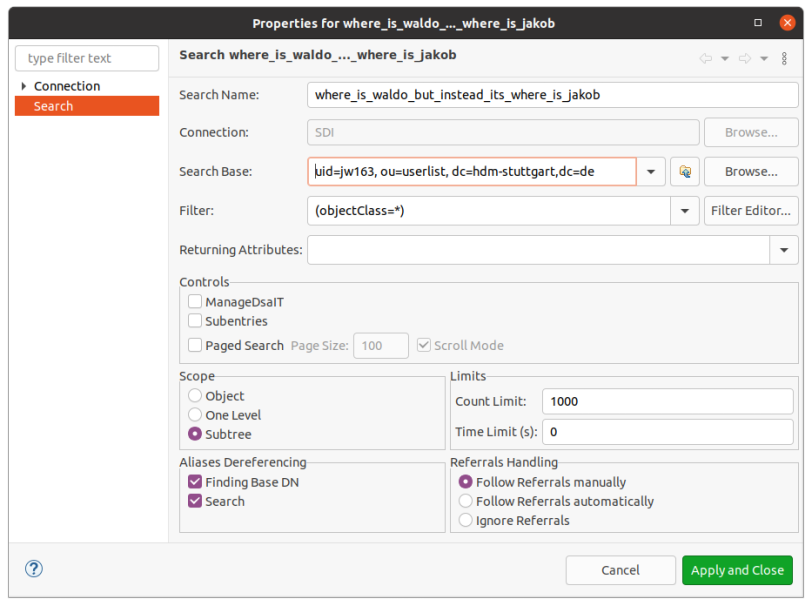
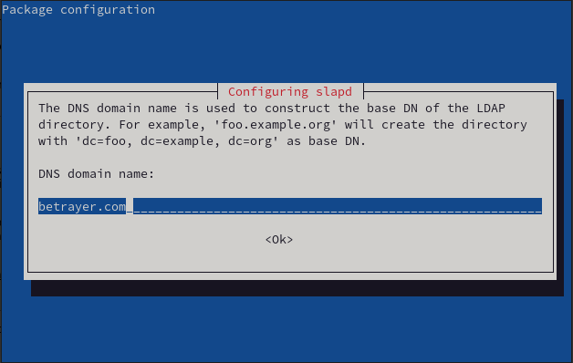
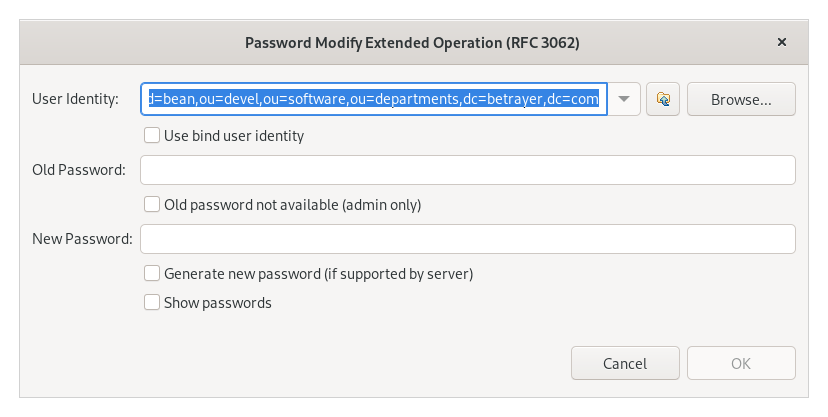

# Software-Defined-Infrastructure

## DNS 

### Use dig to query A/CNAME/MX/NS records from various machines/domains of your choice. 
```
dig jakobwaibel.com
```
```
; <<>> DiG 9.16.8-Ubuntu <<>> jakobwaibel.com
;; global options: +cmd
;; Got answer:
;; ->>HEADER<<- opcode: QUERY, status: NOERROR, id: 28487
;; flags: qr rd ra; QUERY: 1, ANSWER: 2, AUTHORITY: 0, ADDITIONAL: 1

;; OPT PSEUDOSECTION:
; EDNS: version: 0, flags:; udp: 65494
;; QUESTION SECTION:
;jakobwaibel.com.		IN	A

;; ANSWER SECTION:
jakobwaibel.com.	300	IN	A	172.67.143.46
jakobwaibel.com.	300	IN	A	104.21.46.240

;; Query time: 23 msec
;; SERVER: 127.0.0.53#53(127.0.0.53)
;; WHEN: Mon Oct 18 20:22:30 CEST 2021
;; MSG SIZE  rcvd: 76
```

```
dig +noall +answer www.hdm-stuttgart.de
```
```
www.hdm-stuttgart.de.	3499	IN	A	141.62.1.59
www.hdm-stuttgart.de.	3499	IN	A	141.62.1.53
```

```
dig -x 141.62.1.53
```
```
; <<>> DiG 9.16.8-Ubuntu <<>> -x 141.62.1.53
;; global options: +cmd
;; Got answer:
;; ->>HEADER<<- opcode: QUERY, status: NOERROR, id: 27731
;; flags: qr rd ra; QUERY: 1, ANSWER: 1, AUTHORITY: 0, ADDITIONAL: 1

;; OPT PSEUDOSECTION:
; EDNS: version: 0, flags:; udp: 65494
;; QUESTION SECTION:
;53.1.62.141.in-addr.arpa.	IN	PTR

;; ANSWER SECTION:
53.1.62.141.in-addr.arpa. 3600	IN	PTR	iz-www-2.hdm-stuttgart.de.

;; Query time: 167 msec
;; SERVER: 127.0.0.53#53(127.0.0.53)
;; WHEN: Mon Oct 18 20:25:00 CEST 2021
;; MSG SIZE  rcvd: 92
```

### Setup BIND

Install BIND
```
sudo apt update
sudo apt install bind9 bind9utils bind9-doc
```

Check if the bind9 service is running 
```
systemctl status bind9
```

If not, start BIND
```
sudo systemctl start bind9
sudo systemctl enable named
```

Check if BIND (named) is listening on port 53
```
sudo ss -tlnp | grep named
```
```
# ss -tlnp | grep named
LISTEN 0      10                        141.62.75.101:53        0.0.0.0:*    users:(("named",pid=2976,fd=19))
LISTEN 0      10                            127.0.0.1:53        0.0.0.0:*    users:(("named",pid=2976,fd=16))
LISTEN 0      4096                          127.0.0.1:953       0.0.0.0:*    users:(("named",pid=2976,fd=25))
LISTEN 0      10                                [::1]:53           [::]:*    users:(("named",pid=2976,fd=22))
LISTEN 0      10     [fe80::d8f8:4cff:feae:b184]%eth0:53           [::]:*    users:(("named",pid=2976,fd=24))
LISTEN 0      4096                              [::1]:953          [::]:*    users:(("named",pid=2976,fd=26))root@sdi1a:~# ss -tlnp | grep named
LISTEN     0      10     141.62.75.101:53                       *:*                   users:(("named",pid=16759,fd=22))
LISTEN     0      10     127.0.0.1:53                       *:*                   users:(("named",pid=16759,fd=21))
LISTEN     0      128    127.0.0.1:953                      *:*                   users:(("named",pid=16759,fd=23))
```

Check the status of the bind name server
```
# rndc status
version: BIND 9.16.15-Debian (Stable Release) <id:4469e3e>
running on sdi1a: Linux x86_64 5.4.128-1-pve #1 SMP PVE 5.4.128-2 (Wed, 18 Aug 2021 16:20:02 +0200)
boot time: Thu, 21 Oct 2021 12:03:01 GMT
last configured: Thu, 21 Oct 2021 12:03:13 GMT
configuration file: /etc/bind/named.conf
CPUs found: 1
worker threads: 1
UDP listeners per interface: 1
number of zones: 102 (97 automatic)
debug level: 0
xfers running: 0
xfers deferred: 0
soa queries in progress: 0
query logging is OFF
recursive clients: 0/900/1000
tcp clients: 0/150
TCP high-water: 0
server is up and running
```

## Configure BIND

Edit the `/etc/bind/named.conf.options` file.

```
vim /etc/bind/named.conf.options
```
This file should have the following content:
```
options {
	directory "/var/cache/bind";

	// If there is a firewall between you and nameservers you want
	// to talk to, you may need to fix the firewall to allow multiple
	// ports to talk.  See http://www.kb.cert.org/vuls/id/800113

	// If your ISP provided one or more IP addresses for stable 
	// nameservers, you probably want to use them as forwarders.  
	// Uncomment the following block, and insert the addresses replacing 
	// the all-0's placeholder.

	forwarders {
		1.1.1.1; // Cloudflare
		8.8.8.8; // Google
	};

	//========================================================================
	// If BIND logs error messages about the root key being expired,
	// you will need to update your keys.  See https://www.isc.org/bind-keys
	//========================================================================
	dnssec-validation no;
	recursion yes;
	
};
```

Next, we need to add zones for our forward and reverse lookups. Achieve this by editing the `/etc/bind/named.conf.local` file.

```
vim /etc/bind/named.conf.local
```

This file should have the following content:
```
//
// Do any local configuration here
//

// Consider adding the 1918 zones here, if they are not used in your
// organization
//include "/etc/bind/zones.rfc1918";

zone "mi.hdm-stuttgart.de" {
	type master;
	file "/etc/bind/db.mi.hdm-stuttgart.de";
};

zone "75.62.141.in-addr.arpa" {
	type master;
	file "/etc/bind/db.141";
};
```

Create the template for our zone file by copying the template.

```
cp /etc/bind/db.empty /etc/bind/db.mi.hdm-stuttgart.de
```

```
vim /etc/bind/db.mi.hdm-stuttgart.de
```
The file should have the following content

```
; BIND reverse data file for empty rfc1918 zone
;
; DO NOT EDIT THIS FILE - it is used for multiple zones.
; Instead, copy it, edit named.conf, and use that copy.
;
$TTL	86400
; Start of Authority record defining the key characteristics of this zone
@	IN	SOA	ns1.mi.hdm-stuttgart.de. hostmaster.mi.hdm-stuttgart.de. (
			      1		; Serial
			 604800		; Refresh
			  86400		; Retry
			2419200		; Expire
			  86400 )	; Negative Cache TTL

@	IN	NS	ns1.mi.hdm-stuttgart.de.
@	IN	A	141.62.75.101
@	IN	MX	10	mx1.hdm-stuttgart.de.

; A records
www				IN	A	141.62.75.101
sdi1a.mi.hdm-stuttgart.de.	IN	A	141.62.75.101
sdi1b.mi.hdm-stuttgart.de.	IN	A	141.62.75.101
ns1.mi.hdm-stuttgart.de. 	IN	A	141.62.75.101

; CNAME records
www1-1	IN	CNAME	www	
www1-2	IN	CNAME	www	
info	IN	CNAME	www

```

Enable IPv4 in `/etc/default/named`

The content should be:
```
#
# run resolvconf?
RESOLVCONF=no

# startup options for the server
OPTIONS="-4 -u bind"
```

Now create the `/etc/bind/db.141` file and insert the following:

```
;
; BIND reverse data file for local loopback interface
;
$TTL    604800
@       IN      SOA     ns1.mi.hdm-stuttgart.de. hostmaster.mi.hdm-stuttgart.de. (
                              2         ; Serial
                         604800         ; Refresh
                          86400         ; Retry
                        2419200         ; Expire
                         604800 )       ; Negative Cache TTL
;
@	IN	NS	ns1.mi.hdm-stuttgart.de.
101	IN	PTR	sdi1a.mi.hdm-stuttgart.de.

```

Now restart the bind9 service

``` 
systemctl restart bind9
```

Now everything should work accordingly. Test your configurations with the following commands:

```
# dig @141.62.75.101 sdi1a.mi.hdm-stuttgart.de

; <<>> DiG 9.16.15-Debian <<>> @141.62.75.101 sdi1a.mi.hdm-stuttgart.de
; (1 server found)
;; global options: +cmd
;; Got answer:
;; ->>HEADER<<- opcode: QUERY, status: NOERROR, id: 15934
;; flags: qr aa rd ra; QUERY: 1, ANSWER: 1, AUTHORITY: 0, ADDITIONAL: 1

;; OPT PSEUDOSECTION:
; EDNS: version: 0, flags:; udp: 1232
; COOKIE: 38476f14e5071de20100000061752cde10f1ae98e7409184 (good)
;; QUESTION SECTION:
;sdi1a.mi.hdm-stuttgart.de.	IN	A

;; ANSWER SECTION:
sdi1a.mi.hdm-stuttgart.de. 86400 IN	A	141.62.75.101

;; Query time: 0 msec
;; SERVER: 141.62.75.101#53(141.62.75.101)
;; WHEN: Sun Oct 24 11:52:30 CEST 2021
;; MSG SIZE  rcvd: 98

```

```
 dig @141.62.75.101 ns1.mi.hdm-stuttgart.de

; <<>> DiG 9.16.15-Debian <<>> @141.62.75.101 ns1.mi.hdm-stuttgart.de
; (1 server found)
;; global options: +cmd
;; Got answer:
;; ->>HEADER<<- opcode: QUERY, status: NOERROR, id: 5720
;; flags: qr aa rd ra; QUERY: 1, ANSWER: 1, AUTHORITY: 0, ADDITIONAL: 1

;; OPT PSEUDOSECTION:
; EDNS: version: 0, flags:; udp: 1232
; COOKIE: 40f7e22511c8f42e0100000061752d2d56c4468f01c6c800 (good)
;; QUESTION SECTION:
;ns1.mi.hdm-stuttgart.de.	IN	A

;; ANSWER SECTION:
ns1.mi.hdm-stuttgart.de. 86400	IN	A	141.62.75.101

;; Query time: 0 msec
;; SERVER: 141.62.75.101#53(141.62.75.101)
;; WHEN: Sun Oct 24 11:53:49 CEST 2021
;; MSG SIZE  rcvd: 96

```

```
# dig @141.62.75.101 www1-1.mi.hdm-stuttgart.de

; <<>> DiG 9.16.15-Debian <<>> @141.62.75.101 www1-1.mi.hdm-stuttgart.de
; (1 server found)
;; global options: +cmd
;; Got answer:
;; ->>HEADER<<- opcode: QUERY, status: NOERROR, id: 21939
;; flags: qr aa rd ra; QUERY: 1, ANSWER: 2, AUTHORITY: 0, ADDITIONAL: 1

;; OPT PSEUDOSECTION:
; EDNS: version: 0, flags:; udp: 1232
; COOKIE: 0143132ee843744e0100000061752d45fd31a73abc08c9a3 (good)
;; QUESTION SECTION:
;www1-1.mi.hdm-stuttgart.de.	IN	A

;; ANSWER SECTION:
www1-1.mi.hdm-stuttgart.de. 86400 IN	CNAME	www.mi.hdm-stuttgart.de.
www.mi.hdm-stuttgart.de. 86400	IN	A	141.62.75.101

;; Query time: 0 msec
;; SERVER: 141.62.75.101#53(141.62.75.101)
;; WHEN: Sun Oct 24 11:54:13 CEST 2021
;; MSG SIZE  rcvd: 117

root@sdi1a:/etc/bind# 
```

```
dig @141.62.75.101 www1-2.mi.hdm-stuttgart.de

; <<>> DiG 9.16.15-Debian <<>> @141.62.75.101 www1-2.mi.hdm-stuttgart.de
; (1 server found)
;; global options: +cmd
;; Got answer:
;; ->>HEADER<<- opcode: QUERY, status: NOERROR, id: 18823
;; flags: qr aa rd ra; QUERY: 1, ANSWER: 2, AUTHORITY: 0, ADDITIONAL: 1

;; OPT PSEUDOSECTION:
; EDNS: version: 0, flags:; udp: 1232
; COOKIE: b4ce868197631a250100000061752d4ffa262ce084071761 (good)
;; QUESTION SECTION:
;www1-2.mi.hdm-stuttgart.de.	IN	A

;; ANSWER SECTION:
www1-2.mi.hdm-stuttgart.de. 86400 IN	CNAME	www.mi.hdm-stuttgart.de.
www.mi.hdm-stuttgart.de. 86400	IN	A	141.62.75.101

;; Query time: 0 msec
;; SERVER: 141.62.75.101#53(141.62.75.101)
;; WHEN: Sun Oct 24 11:54:23 CEST 2021
;; MSG SIZE  rcvd: 117

```

```
# dig @141.62.75.101 info.mi.hdm-stuttgart.de

; <<>> DiG 9.16.15-Debian <<>> @141.62.75.101 info.mi.hdm-stuttgart.de
; (1 server found)
;; global options: +cmd
;; Got answer:
;; ->>HEADER<<- opcode: QUERY, status: NOERROR, id: 5033
;; flags: qr aa rd ra; QUERY: 1, ANSWER: 2, AUTHORITY: 0, ADDITIONAL: 1

;; OPT PSEUDOSECTION:
; EDNS: version: 0, flags:; udp: 1232
; COOKIE: 294653251b1b58c20100000061752d6a07e56e6fc50e545c (good)
;; QUESTION SECTION:
;info.mi.hdm-stuttgart.de.	IN	A

;; ANSWER SECTION:
info.mi.hdm-stuttgart.de. 86400	IN	CNAME	www.mi.hdm-stuttgart.de.
www.mi.hdm-stuttgart.de. 86400	IN	A	141.62.75.101

;; Query time: 0 msec
;; SERVER: 141.62.75.101#53(141.62.75.101)
;; WHEN: Sun Oct 24 11:54:50 CEST 2021
;; MSG SIZE  rcvd: 115

```

```
# dig @141.62.75.101 mx1.hdm-stuttgart.de

; <<>> DiG 9.16.15-Debian <<>> @141.62.75.101 mx1.hdm-stuttgart.de
; (1 server found)
;; global options: +cmd
;; Got answer:
;; ->>HEADER<<- opcode: QUERY, status: NOERROR, id: 45334
;; flags: qr rd ra; QUERY: 1, ANSWER: 1, AUTHORITY: 0, ADDITIONAL: 1

;; OPT PSEUDOSECTION:
; EDNS: version: 0, flags:; udp: 1232
; COOKIE: 250912354598ef4f0100000061752db4dcd3a65394a4e05a (good)
;; QUESTION SECTION:
;mx1.hdm-stuttgart.de.		IN	A

;; ANSWER SECTION:
mx1.hdm-stuttgart.de.	2390	IN	A	141.62.1.22

;; Query time: 0 msec
;; SERVER: 141.62.75.101#53(141.62.75.101)
;; WHEN: Sun Oct 24 11:56:04 CEST 2021
;; MSG SIZE  rcvd: 93

```

```
# dig @141.62.75.101 www.google.com

; <<>> DiG 9.16.15-Debian <<>> @141.62.75.101 www.google.com
; (1 server found)
;; global options: +cmd
;; Got answer:
;; ->>HEADER<<- opcode: QUERY, status: NOERROR, id: 51453
;; flags: qr rd ra; QUERY: 1, ANSWER: 1, AUTHORITY: 0, ADDITIONAL: 1

;; OPT PSEUDOSECTION:
; EDNS: version: 0, flags:; udp: 1232
; COOKIE: e2c3965c0b2a669a0100000061752dc21bed21ef598dd7f6 (good)
;; QUESTION SECTION:
;www.google.com.			IN	A

;; ANSWER SECTION:
www.google.com.		137	IN	A	142.250.186.68

;; Query time: 11 msec
;; SERVER: 141.62.75.101#53(141.62.75.101)
;; WHEN: Sun Oct 24 11:56:18 CEST 2021
;; MSG SIZE  rcvd: 87

```

```
# dig @141.62.75.101 -x 141.62.75.101

; <<>> DiG 9.16.15-Debian <<>> @141.62.75.101 -x 141.62.75.101
; (1 server found)
;; global options: +cmd
;; Got answer:
;; ->>HEADER<<- opcode: QUERY, status: NOERROR, id: 36454
;; flags: qr aa rd ra; QUERY: 1, ANSWER: 1, AUTHORITY: 0, ADDITIONAL: 1

;; OPT PSEUDOSECTION:
; EDNS: version: 0, flags:; udp: 1232
; COOKIE: b1a16000bbd7c0420100000061752dd7df9f14643255bb09 (good)
;; QUESTION SECTION:
;101.75.62.141.in-addr.arpa.	IN	PTR

;; ANSWER SECTION:
101.75.62.141.in-addr.arpa. 604800 IN	PTR	sdi1a.mi.hdm-stuttgart.de.

;; Query time: 0 msec
;; SERVER: 141.62.75.101#53(141.62.75.101)
;; WHEN: Sun Oct 24 11:56:39 CEST 2021
;; MSG SIZE  rcvd: 122

```

## LDAP

### Browsing an existing LDAP Server using `Apache Directory Studio`

#### Setup Apache Directory Studio to anonymously connect to ldap1.hdm-stuttgart.de using TLS.

To setup Apache Directory Studio to connect to the LDAP server, create a new connection with the following properties: 


If your connection was successful, your user interface should look somewhat like this: 


#### Use a filter like (uid-xy234) to find your personal entry beneath ou=userlist,dc=hdm-stuttgart,dc=de, Use the corresponding DN e.g. uid=xy234, ou=userlist,dc=hdm-stuttgart,dc=de to reconnect using password authentication. Then browse your own entry again. Can you spot any difference?

Therefore, you right-click on the userlist and apply a filter on the children. This should work like displayed in the following two pictures.


As one can see in the picture below, the entry appears and can be examined further by clicking on it.


The other option to find ones own entry is to create a search. The content should look somewhat like in the following picture.



Then ones user should be found and can be examined. 


After following the same steps while being logged in, the user entry should look more like in the following picture. As one can see, some more personal information like the hash of the users password or his student-identification number is provided.


### Browsing an existing LDAP Server using `ldapsearch`

#### Setup ldapsearch to anonymously connect to ldap1.hdm-stuttgart.de using TLS.

The following command connects to the LDAP server and displays the information below. The output is a shortened version, as there are too many user entries to display here.

```shell
$ ldapsearch -x -b "ou=userlist,dc=hdm-stuttgart,dc=de" -H ldap://ldap1.hdm-stuttgart.de
```

```shell
# gast39, userlist, hdm-stuttgart.de
dn: uid=gast39,ou=userlist,dc=hdm-stuttgart,dc=de
hdmCategory: 4
sn: fixme
loginShell: /bin/sh
uidNumber: 46139
gidNumber: 35102
uid: gast39
objectClass: inetOrgPerson
objectClass: posixAccount
objectClass: shadowAccount
objectClass: hdmAccount
objectClass: hdmSambaDomain
objectClass: eduPerson
cn:: dW5rbm93biA=
homeDirectory: /home/stud/XX/gast39
givenName: Gast
eduPersonAffiliation: faculty
eduPersonAffiliation: library-walk-in

# gast38, userlist, hdm-stuttgart.de
dn: uid=gast38,ou=userlist,dc=hdm-stuttgart,dc=de
hdmCategory: 4
sn: fixme
loginShell: /bin/sh
uidNumber: 46138
gidNumber: 35102
uid: gast38
objectClass: inetOrgPerson
objectClass: posixAccount
objectClass: shadowAccount
objectClass: hdmAccount
objectClass: hdmSambaDomain
objectClass: eduPerson
cn:: dW5rbm93biA=
homeDirectory: /home/stud/XX/gast38
givenName: Gast
eduPersonAffiliation: faculty
eduPersonAffiliation: library-walk-in
```

#### Use a filter like (uid-xy234) to find your personal entry beneath ou=userlist,dc=hdm-stuttgart,dc=de, Use the corresponding DN e.g. uid=xy234, ou=userlist,dc=hdm-stuttgart,dc=de to reconnect using password authentication. Then browse your own entry again. Can you spot any difference?	

```shell
$ ldapsearch -x -b "uid=jw163, ou=userlist,dc=hdm-stuttgart,dc=de" -H ldap://ldap1.hdm-stuttgart.de
# extended LDIF
#
# LDAPv3
# base <uid=jw163, ou=userlist,dc=hdm-stuttgart,dc=de> with scope subtree
# filter: (objectclass=*)
# requesting: ALL
#

# jw163, userlist, hdm-stuttgart.de
dn: uid=jw163,ou=userlist,dc=hdm-stuttgart,dc=de
displayName: Waibel Jakob Elias
employeeType: student
objectClass: hdmAccount
objectClass: hdmStudent
objectClass: inetOrgPerson
objectClass: posixAccount
objectClass: shadowAccount
objectClass: eduPerson
eduPersonAffiliation: member
eduPersonAffiliation: student
eduPersonAffiliation: library-walk-in
uid: jw163
mail: jw163@hdm-Stuttgart.de
uidNumber: 67828
cn: Waibel Jakob Elias
loginShell: /bin/sh
hdmCategory: 1
gidNumber: 100
givenName: Jakob Elias
homeDirectory: /home/stud/j/jw163
sn: Waibel

# search result
search: 2
result: 0 Success

# numResponses: 2
# numEntries: 1
```

After being logged in, we can spot some more information:

```shell
$ ldapsearch -x -D "uid=jw163, ou=userlist,dc=hdm-stuttgart,dc=de"  -W -H ldap://ldap1.hdm-stuttgart.de -b " uid=jw163, ou=userlist,dc=hdm-stuttgart,dc=de"  -s sub 'uid=jw163'
Enter LDAP Password: 
# extended LDIF
#
# LDAPv3
# base < uid=jw163, ou=userlist,dc=hdm-stuttgart,dc=de> with scope subtree
# filter: uid=jw163
# requesting: ALL
#

# jw163, userlist, hdm-stuttgart.de
dn: uid=jw163,ou=userlist,dc=hdm-stuttgart,dc=de
businessCategory: 1
businessCategory: {11112-3}
employeeType: student
postOfficeBox: 2G
objectClass: hdmAccount
objectClass: hdmStudent
objectClass: inetOrgPerson
objectClass: posixAccount
objectClass: shadowAccount
objectClass: eduPerson
eduPersonAffiliation: member
eduPersonAffiliation: student
eduPersonAffiliation: library-walk-in
uid: jw163
mail: jw163@hdm-Stuttgart.de
uidNumber: 67828
cn: Waibel Jakob Elias
loginShell: /bin/sh
hdmCategory: 1
gidNumber: 100
employeeNumber: CENSORED
givenName: Jakob Elias
homeDirectory: /home/stud/j/jw163
sn: Waibel
matrikelNr: CENSORED 
userPassword:: CENSORED
shadowLastChange: 18316
sambaNTPassword: CENSORED

# search result
search: 2
result: 0 Success

# numResponses: 2
# numEntries: 1
```

### Setup an OpenLDAP server

First of all, one might use the following commands to install some useful utilities.

```shell
# apt install dialog
```

```shell
# apt install slapd
```

In the following, the admin password is set to `password`. Please make sure you are using a more secure password than we are when configuring your LDAP server.	

With `dpkg-reconfigure slapd`, you can modify your base configuration. Following the dialog accordingly should lead to  a successful result.


After setting up slapd, we can use `ss -tlnp` to verify that a server is running.

```shell
# ss -tlnp
State                    Recv-Q                   Send-Q                                     Local Address:Port                                       Peer Address:Port                   Process                                             
LISTEN                   0                        10                                         141.62.75.101:53                                              0.0.0.0:*                       users:(("named",pid=448,fd=19))                    
LISTEN                   0                        10                                             127.0.0.1:53                                              0.0.0.0:*                       users:(("named",pid=448,fd=16))                    
LISTEN                   0                        128                                              0.0.0.0:22                                              0.0.0.0:*                       users:(("sshd",pid=127,fd=3))                      
LISTEN                   0                        4096                                           127.0.0.1:953                                             0.0.0.0:*                       users:(("named",pid=448,fd=21))                    
LISTEN                   0                        100                                            127.0.0.1:25                                              0.0.0.0:*                       users:(("master",pid=292,fd=13))                   
LISTEN                   0                        1024                                             0.0.0.0:389                                             0.0.0.0:*                       users:(("slapd",pid=7245,fd=8))                    
LISTEN                   0                        128                                                 [::]:22                                                 [::]:*                       users:(("sshd",pid=127,fd=4))                      
LISTEN                   0                        100                                                [::1]:25                                                 [::]:*                       users:(("master",pid=292,fd=14))                   
LISTEN                   0                        1024                                                [::]:389                                                [::]:*                       users:(("slapd",pid=7245,fd=9))
```

```shell
ldapsearch -Q -LLL -Y EXTERNAL -H ldapi:/// -b cn=config dn
dn: cn=config

dn: cn=module{0},cn=config

dn: cn=schema,cn=config

dn: cn={0}core,cn=schema,cn=config

dn: cn={1}cosine,cn=schema,cn=config

dn: cn={2}nis,cn=schema,cn=config

dn: cn={3}inetorgperson,cn=schema,cn=config

dn: olcDatabase={-1}frontend,cn=config

dn: olcDatabase={0}config,cn=config

dn: olcDatabase={1}mdb,cn=config
```

```shell
# ldapwhoami -x 
anonymous
```

As mentioned in the task, we need to rename the `dc` to `betrayer.com`. So we just do `dpkg-reconfigure slapd` another time using the required information.



We can now use `ldapwhoami` with our configuration:

```shell
# ldapwhoami -x -D cn=admin,dc=betrayer,dc=com -W
Enter LDAP Password: 
dn:cn=admin,dc=betrayer,dc=com
```

We can connect to our server using Apache Directory Studio with the following configuration.


To authorize as an administrator, we just use our admin credentials.


### Populating your DIT

After creating our LDAP tree, it looks like this: 


Our export dump looks like this: 

```ldif
version: 1

dn: dc=betrayer,dc=com
objectClass: dcObject
objectClass: organization
objectClass: top
dc: betrayer
o: betrayer.com

dn: cn=admin,dc=betrayer,dc=com
objectClass: organizationalRole
objectClass: simpleSecurityObject
cn: admin
userPassword:: e1NTSEF9cEhFK0VQT0cyZ3lSeU9nanZGcXNXT2I1ekdzR2w5Q0Q=
description: LDAP administrator

dn: ou=departments,dc=betrayer,dc=com
objectClass: organizationalUnit
objectClass: top
ou: departments

dn: ou=software,ou=departments,dc=betrayer,dc=com
objectClass: organizationalUnit
objectClass: top
ou: software

dn: ou=financial,ou=departments,dc=betrayer,dc=com
objectClass: organizationalUnit
objectClass: top
ou: financial

dn: ou=devel,ou=software,ou=departments,dc=betrayer,dc=com
objectClass: organizationalUnit
objectClass: top
ou: devel

dn: ou=testing,ou=software,ou=departments,dc=betrayer,dc=com
objectClass: organizationalUnit
objectClass: top
ou: testing

dn: uid=bean,ou=devel,ou=software,ou=departments,dc=betrayer,dc=com
objectClass: inetOrgPerson
objectClass: organizationalPerson
objectClass: person
objectClass: top
cn: Audrey Bean
sn: Bean
givenName: Audrey
mail: bean@betrayer.com
uid: bean
userPassword:: e3NtZDV9YVhKL2JlVkF2TDRENk9pMFRLcDhjM3ovYTZQZzBXeHA=

dn: uid=smith,ou=devel,ou=software,ou=departments,dc=betrayer,dc=com
objectClass: inetOrgPerson
objectClass: organizationalPerson
objectClass: person
objectClass: top
cn: Jane Smith
sn: Smith
givenName: Jane
mail: smith@betrayer.com
uid: smith
userPassword:: e3NtZDV9YVhKL2JlVkF2TDRENk9pMFRLcDhjM3ovYTZQZzBXeHA=

dn: uid=waibel,ou=financial,ou=departments,dc=betrayer,dc=com
objectClass: inetOrgPerson
objectClass: organizationalPerson
objectClass: person
objectClass: top
cn: Jakob Waibel
sn: Waibel
givenName: Jakob
mail: waibel@betrayer.com
uid: waibel
userPassword:: e3NtZDV9YVhKL2JlVkF2TDRENk9pMFRLcDhjM3ovYTZQZzBXeHA=

dn: uid=simpson,ou=financial,ou=departments,dc=betrayer,dc=com
objectClass: inetOrgPerson
objectClass: organizationalPerson
objectClass: person
objectClass: top
cn: Homer Simpson
sn: Simpson
givenName: Homer
mail: simpson@betrayer.com
uid: simpson
userPassword:: e3NtZDV9YVhKL2JlVkF2TDRENk9pMFRLcDhjM3ovYTZQZzBXeHA=

dn: uid=pojtinger,ou=testing,ou=software,ou=departments,dc=betrayer,dc=com
objectClass: inetOrgPerson
objectClass: organizationalPerson
objectClass: person
objectClass: top
cn: Felix Pojtinger
sn: Pojtinger
givenName: Felix
mail: pojtinger@betrayer.com
uid: pojtinger
userPassword:: e3NtZDV9YVhKL2JlVkF2TDRENk9pMFRLcDhjM3ovYTZQZzBXeHA=

dn: uid=simpson,ou=testing,ou=software,ou=departments,dc=betrayer,dc=com
objectClass: inetOrgPerson
objectClass: organizationalPerson
objectClass: person
objectClass: top
cn: Maggie Simpson
sn: Simpson
givenName: Maggie
mail: simpson@betrayer.com
uid: simpson
userPassword:: e3NtZDV9YVhKL2JlVkF2TDRENk9pMFRLcDhjM3ovYTZQZzBXeHA=
```

### Testing a bind operation as non - admin user

First we set a password for `bean`. In our case, we set the password to `password`.



Afterwards we create a new connection with the following properties for the authentication section:


After that, our new connection looks like this: 


### Extending an existing entry

To extend an existing entry and to add a `posixAccount`, one needs to right-click on the `objectClass` attribute and click on `New Value`.  


After that look for the `posixAccount` like displayed in the screenshot and `Add` it so it appears in the right column. After clicking `Next`, one needs to specify a valid `gidNumber`, `homeDirectory` and `uidNumber`. Now complete the configuration by clicking on `Finish`.

### Filter based search

#### All users with a uid attribute value starting with the letter “b”.


#### All entries either with either a defined uid attribute or a ou attribute starting with letter “d”.


#### All users entries within the whole DIT having a gidNumber value of 100.


#### All user entries belonging to the billing department having a uid value greater than 1023.


#### All user entries within the whole DIT having a commonName containing the substring “ei”.


#### All user entries within the whole DIT belonging to gidNumber == 100 or having a uid value starting with letter “t”.


#### Accessing LDAP data by a mail client

To use LDAP data with a mail client, it is necessary to add a new address book. It's configuration is displayed in the picture below:


After configuring the address book, addresses are only available when searching. As shown in the following picture, we can now find the fictional characters we created when populating our tree. 


#### LDAP configuration

```bash
# ldapsearch -Y EXTERNAL -H ldapi:/// -b cn=config
SASL/EXTERNAL authentication started
SASL username: gidNumber=0+uidNumber=0,cn=peercred,cn=external,cn=auth
SASL SSF: 0
# extended LDIF
#
# LDAPv3
# base <cn=config> with scope subtree
# filter: (objectclass=*)
# requesting: ALL
#

# config
dn: cn=config
objectClass: olcGlobal
cn: config
olcArgsFile: /var/run/slapd/slapd.args
olcLogLevel: none
olcPidFile: /var/run/slapd/slapd.pid
olcToolThreads: 1

# module{0}, config
dn: cn=module{0},cn=config
objectClass: olcModuleList
cn: module{0}
olcModulePath: /usr/lib/ldap
olcModuleLoad: {0}back_mdb

# schema, config
dn: cn=schema,cn=config
objectClass: olcSchemaConfig
cn: schema
olcObjectIdentifier: OLcfg 1.3.6.1.4.1.4203.1.12.2
olcObjectIdentifier: OLcfgAt OLcfg:3
olcObjectIdentifier: OLcfgGlAt OLcfgAt:0
...
olcDatabase: {-1}frontend
olcAccess: {0}to * by dn.exact=gidNumber=0+uidNumber=0,cn=peercred,cn=external
 ,cn=auth manage by * break
olcAccess: {1}to dn.exact="" by * read
olcAccess: {2}to dn.base="cn=Subschema" by * read
olcSizeLimit: 500

# {0}config, config
dn: olcDatabase={0}config,cn=config
objectClass: olcDatabaseConfig
olcDatabase: {0}config
olcAccess: {0}to * by dn.exact=gidNumber=0+uidNumber=0,cn=peercred,cn=external
 ,cn=auth manage by * break
olcRootDN: cn=admin,cn=config

# {1}mdb, config
dn: olcDatabase={1}mdb,cn=config
objectClass: olcDatabaseConfig
objectClass: olcMdbConfig
olcDatabase: {1}mdb
olcDbDirectory: /var/lib/ldap
olcSuffix: dc=betrayer,dc=com
olcAccess: {0}to attrs=userPassword by self write by anonymous auth by * none
olcAccess: {1}to attrs=shadowLastChange by self write by * read
olcAccess: {2}to * by * read
olcLastMod: TRUE
olcRootDN: cn=admin,dc=betrayer,dc=com
olcRootPW: {SSHA}0mF0mX3FUNd0zZ0u3bKPQQA1ubycnHvh
olcDbCheckpoint: 512 30
olcDbIndex: objectClass eq
olcDbIndex: cn,uid eq
olcDbIndex: uidNumber,gidNumber eq
olcDbIndex: member,memberUid eq
olcDbMaxSize: 1073741824

# search result
search: 2
result: 0 Success

# numResponses: 11
# numEntries: 10
```

As mentioned in the task, we find the required information near the end of the output. In the first occurence of `oldRootDN`, where `olcRootDN: cn=admin,cn=config`, no passwort is set afterwards. In the second occurence `olcRootDN=cn=admin,dc=betrayer,dc=com`, a password is set with `oldRootPW`. This password not being specified implies that configuration access is limited to localhost.

To change these settings, we must create a LDIF file which sets the required properties. A password hash can be generated using a website like: https://projects.marsching.org/weave4j/util/genpassword.php. We chose to use the password `password` again. 

```bash
# cat add_olcRootPW.ldif 
dn: olcDatabase={0}config,cn=config
replace: olcRootPW
olcRootPW: {ssha}U1oLsngiAsXhFQrav5UzHxn2/9qPNcL+
```

```bash
# ldapmodify -Q -Y EXTERNAL -H ldapi:/// -f ~/add_olcRootPW.ldif
modifying entry "olcDatabase={0}config,cn=config"

```


After connecting, we can set the `olcLogLevel`. There are multiple options to set the log level to. We decided to get the most information possible, which is achieved by using the `olcLogLevel` of `-1`. 


Now we can look at the syslog with `cat /var/log/syslog`. 


#### LDAP based user login

First, we create a backup of our working PAM configuration.

```bash
cd /etc
tar zcf /root/pam.tgz pam.conf pam.d
```

We can then check if all worked correctly:

```bash
# tar ztf /root/pam.tgz 
pam.conf
pam.d/
pam.d/passwd
pam.d/sshd
pam.d/common-auth
pam.d/common-session-noninteractive
pam.d/runuser-l
pam.d/su
pam.d/other
pam.d/su-l
pam.d/cron
pam.d/runuser
pam.d/common-password
pam.d/chpasswd
pam.d/common-session
pam.d/chsh
pam.d/login
pam.d/common-account
pam.d/newusers
pam.d/chfn
```

Install `libpam-ldapd` via `apt install libpam-ldapd`.

Configure the server like displayed in the following screenshots.


Then we reboot our server and continue the configuration.

Test your LDAP setup: 

```bash
# id waibel
uid=1337(waibel) gid=100(users) groups=100(users)
```

Edit the `passwd`, `group` and `shadow` line in your `/etc/nsswitch.conf` so that they look similar than in our configuration: 

```bash
# cat /etc/nsswitch.conf 
# /etc/nsswitch.conf
#
# Example configuration of GNU Name Service Switch functionality.
# If you have the `glibc-doc-reference' and `info' packages installed, try:
# `info libc "Name Service Switch"' for information about this file.

passwd:         files ldap
group:          files ldap
shadow:         files ldap
gshadow:        files

hosts:          files dns
networks:       files

protocols:      db files
services:       db files
ethers:         db files
rpc:            db files

netgroup:       nis
```

Make sure that `PasswordAuthentication` is set to `no` in `/etc/ssh/sshd_config`:

```bash
# cat /etc/ssh/sshd_config
#	$OpenBSD: sshd_config,v 1.103 2018/04/09 20:41:22 tj Exp $

# This is the sshd server system-wide configuration file.  See
# sshd_config(5) for more information.

# This sshd was compiled with PATH=/usr/bin:/bin:/usr/sbin:/sbin

# The strategy used for options in the default sshd_config shipped with
# OpenSSH is to specify options with their default value where
# possible, but leave them commented.  Uncommented options override the
# default value.

Include /etc/ssh/sshd_config.d/*.conf

#Port 22
#AddressFamily any
#ListenAddress 0.0.0.0
#ListenAddress ::

#HostKey /etc/ssh/ssh_host_rsa_key
#HostKey /etc/ssh/ssh_host_ecdsa_key
#HostKey /etc/ssh/ssh_host_ed25519_key

# Ciphers and keying
#RekeyLimit default none

# Logging
#SyslogFacility AUTH
#LogLevel INFO

# Authentication:

#LoginGraceTime 2m
#PermitRootLogin prohibit-password
#StrictModes yes
#MaxAuthTries 6
#MaxSessions 10

#PubkeyAuthentication yes

# Expect .ssh/authorized_keys2 to be disregarded by default in future.
#AuthorizedKeysFile	.ssh/authorized_keys .ssh/authorized_keys2

#AuthorizedPrincipalsFile none

#AuthorizedKeysCommand none
#AuthorizedKeysCommandUser nobody

# For this to work you will also need host keys in /etc/ssh/ssh_known_hosts
#HostbasedAuthentication no
# Change to yes if you don't trust ~/.ssh/known_hosts for
# HostbasedAuthentication
#IgnoreUserKnownHosts no
# Don't read the user's ~/.rhosts and ~/.shosts files
#IgnoreRhosts yes

# To disable tunneled clear text passwords, change to no here!
PasswordAuthentication no
#PermitEmptyPasswords no

# Change to yes to enable challenge-response passwords (beware issues with
# some PAM modules and threads)
ChallengeResponseAuthentication no

# Kerberos options
#KerberosAuthentication no
#KerberosOrLocalPasswd yes
#KerberosTicketCleanup yes
#KerberosGetAFSToken no

# GSSAPI options
#GSSAPIAuthentication no
#GSSAPICleanupCredentials yes
#GSSAPIStrictAcceptorCheck yes
#GSSAPIKeyExchange no

# Set this to 'yes' to enable PAM authentication, account processing,
# and session processing. If this is enabled, PAM authentication will
# be allowed through the ChallengeResponseAuthentication and
# PasswordAuthentication.  Depending on your PAM configuration,
# PAM authentication via ChallengeResponseAuthentication may bypass
# the setting of "PermitRootLogin without-password".
# If you just want the PAM account and session checks to run without
# PAM authentication, then enable this but set PasswordAuthentication
# and ChallengeResponseAuthentication to 'no'.
UsePAM yes

#AllowAgentForwarding yes
#AllowTcpForwarding yes
#GatewayPorts no
X11Forwarding yes
#X11DisplayOffset 10
#X11UseLocalhost yes
#PermitTTY yes
PrintMotd no
#PrintLastLog yes
#TCPKeepAlive yes
#PermitUserEnvironment no
#Compression delayed
#ClientAliveInterval 0
#ClientAliveCountMax 3
#UseDNS no
#PidFile /var/run/sshd.pid
#MaxStartups 10:30:100
#PermitTunnel no
#ChrootDirectory none
#VersionAddendum none

# no default banner path
#Banner none

# Allow client to pass locale environment variables
AcceptEnv LANG LC_*

# override default of no subsystems
Subsystem	sftp	/usr/lib/openssh/sftp-server

# Example of overriding settings on a per-user basis
#Match User anoncvs
#	X11Forwarding no
#	AllowTcpForwarding no
#	PermitTTY no
#	ForceCommand cvs server
```

To make sure the results are not influenced by unwanted caching, we stop the `nscd` service.

```bash
# systemctl stop nscd
# systemctl status nscd
● nscd.service - Name Service Cache Daemon
     Loaded: loaded (/lib/systemd/system/nscd.service; enabled; vendor preset:>
     Active: inactive (dead) since Wed 2021-11-17 21:26:35 CET; 4s ago
    Process: 77 ExecStart=/usr/sbin/nscd (code=exited, status=0/SUCCESS)
    Process: 364 ExecStop=/usr/sbin/nscd --shutdown (code=exited, status=0/SUC>
   Main PID: 80 (code=exited, status=0/SUCCESS)

Nov 17 21:17:27 sdi1b nscd[80]: 80 monitoring directory `/etc` (2)
Nov 17 21:17:27 sdi1b nscd[80]: 80 monitoring file `/etc/services` (6)
Nov 17 21:17:27 sdi1b nscd[80]: 80 monitoring directory `/etc` (2)
Nov 17 21:17:27 sdi1b nscd[80]: 80 disabled inotify-based monitoring for file >
Nov 17 21:17:27 sdi1b nscd[80]: 80 stat failed for file `/etc/netgroup'; will >
Nov 17 21:17:27 sdi1b systemd[1]: Started Name Service Cache Daemon.
Nov 17 21:17:46 sdi1b nscd[80]: 80 checking for monitored file `/etc/netgroup'>
Nov 17 21:26:35 sdi1b systemd[1]: Stopping Name Service Cache Daemon...
Nov 17 21:26:35 sdi1b systemd[1]: nscd.service: Succeeded.
Nov 17 21:26:35 sdi1b systemd[1]: Stopped Name Service Cache Daemon.
```

With `mkhomedir_helper waibel`, we create a new homedirectory and modify the access rights. The result should look somewhat like this:

```bash
drwxr-xr-x  2 waibel users   5 Nov 17 21:32 jakob
```

```bash 
# id waibel
uid=1337(waibel) gid=100(users) groups=100(users)
```

TODO: Are we finished here?

#### Backup and recovery / restore

First, we setup a second LDAP server on `sdi1b.mi.hdm-stuttgart.de`. 

Now we dump the configuration and the data into ldif files.
```bash
# slapcat -b cn=config -l ldap-config.ldif 
# slapcat -l ldap-data.ldif
```

After creating an ssh-key on `sdi1a` and adding its public key to the `authorized_keys` file on `sdi1b` we can use scp to transfer the files from `sdi1a` to `sdi1b`.

```bash
# scp {ldap-config.ldif,ldap-data.ldif} root@sdi1b.mi.hdm-stuttgart.de:~
ldap-config.ldif                             100%   38KB  18.0MB/s   00:00    
ldap-data.ldif                               100% 7977    19.0MB/s   00:00    
```

On `sdi1b` we stop the `slapd` service with `systemctl stop slapd` and we restore the configuration and data using `slapadd`:

```bash
# slapadd -b cn=config -l ~/ldap-config.ldif -F /etc/ldap/slapd.d/
# slapadd -n 1 -l ~/ldap-data.ldif -F /etc/ldap/slapd.d/
```

To ensure everything worked, we create a new ldif file based on the data on the backup server. Afterwards, the new ldif file can be displayed and we can see that everything worked.

```bash
# slapcat -l ldap-data-b.ldif
```

```bash 
# cat ldap-data-b.ldif 
dn: dc=betrayer,dc=com
structuralObjectClass: organization
entryUUID: 1c2b9bf0-d8b8-103b-9330-2bdbf336837c
creatorsName: cn=admin,dc=betrayer,dc=com
createTimestamp: 20211113102755Z
objectClass: organization
objectClass: dcObject
objectClass: top
dc: betrayer
o: betrayer.com
entryCSN: 20211115133040.851821Z#000000#000#000000
modifiersName: cn=admin,dc=betrayer,dc=com
modifyTimestamp: 20211115133040Z

dn: cn=admin,dc=betrayer,dc=com
description: LDAP administrator
cn: admin
objectClass: organizationalRole
objectClass: simpleSecurityObject
userPassword:: e1NTSEF9cEhFK0VQT0cyZ3lSeU9nanZGcXNXT2I1ekdzR2w5Q0Q=
structuralObjectClass: organizationalRole
entryUUID: f89e4158-da63-103b-9b6b-03efa5ff8503
creatorsName: cn=admin,dc=betrayer,dc=com
createTimestamp: 20211115133040Z
entryCSN: 20211115133040.866711Z#000000#000#000000
modifiersName: cn=admin,dc=betrayer,dc=com
modifyTimestamp: 20211115133040Z

dn: ou=departments,dc=betrayer,dc=com
ou: departments
objectClass: top
objectClass: organizationalUnit
structuralObjectClass: organizationalUnit
entryUUID: f89f5066-da63-103b-9b6c-03efa5ff8503
creatorsName: cn=admin,dc=betrayer,dc=com
createTimestamp: 20211115133040Z
entryCSN: 20211115133040.873650Z#000000#000#000000
modifiersName: cn=admin,dc=betrayer,dc=com
modifyTimestamp: 20211115133040Z

dn: ou=software,ou=departments,dc=betrayer,dc=com
ou: software
objectClass: top
objectClass: organizationalUnit
structuralObjectClass: organizationalUnit
entryUUID: f8a05240-da63-103b-9b6d-03efa5ff8503
creatorsName: cn=admin,dc=betrayer,dc=com
createTimestamp: 20211115133040Z
entryCSN: 20211115133040.880251Z#000000#000#000000
modifiersName: cn=admin,dc=betrayer,dc=com
modifyTimestamp: 20211115133040Z
...
```

TODO: Check that the checksum matches and slapd-service is running 

#### Accessing LDAP by a Go application

```Go
package main

import (
	"flag"
	"fmt"
	"log"

	"github.com/go-ldap/ldap"
)

func main() {
	uid := flag.String("uid", "", "User-Id e.g. jw163")
	password := flag.String("pw", "", "Password e.g. password")
	flag.Parse()

	ldapURL := "ldaps://ldap1.mi.hdm-stuttgart.de"
	l, err := ldap.DialURL(ldapURL)
	if err != nil {
		log.Fatal(err)
	}

	defer l.Close()
	err = l.Bind(fmt.Sprintf("uid=%s, ou=userlist,dc=hdm-stuttgart,dc=de", *uid), *password)
	if err != nil {
		log.Fatal(err)
	}

	// Until here, everything should work
	BaseDN := "dc=hdm-stuttgart,dc=de"
	Filter := fmt.Sprintf("(uid=%s)", *uid)
	searchReq := ldap.NewSearchRequest(
		BaseDN,
		ldap.ScopeWholeSubtree,
		ldap.NeverDerefAliases,
		0,
		0,
		false,
		Filter,
		[]string{},
		nil,
	)
	result, err := l.Search(searchReq)
	if err != nil {
		log.Fatal(err)
	}

	if len(result.Entries) > 0 {
		result.PrettyPrint(4)
	} else {
		fmt.Println("Couldn't fetch search entries")
	}
}
```

When executing the program, the output looks like this: 

```bash
$ go run main.go --uid=jw163 --pw=CENSORED
    DN: uid=jw163,ou=userlist,dc=hdm-stuttgart,dc=de
      objectClass: [hdmAccount hdmStudent inetOrgPerson posixAccount shadowAccount eduPerson]
      uid: [jw163]
      mail: [jw163@hdm-Stuttgart.de]
      uidNumber: [67828]
      cn: [Waibel Jakob Elias]
      loginShell: [/bin/sh]
      hdmCategory: [1]
      gidNumber: [100]
      givenName: [Jakob Elias]
      homeDirectory: [/home/stud/j/jw163]
      sn: [Waibel]
      matrikelNr: [40062]
```

TODO: Why aren't we getting the detailed version? I can't access the detailed version in Apache Directory Studio either

## Apache Web Server

Intall the Apache Web Server:

```shell
apt install apache2
```

Start the `apache2.service`:

```shell
systemctl start apache2.service
```

Check the status of the `apache2.service` service to make sure everything works accordingly:

```shell
# systemctl status apache2.service
● apache2.service - The Apache HTTP Server
     Loaded: loaded (/lib/systemd/system/apache2.service; enabled; vendor preset: enabled)
     Active: active (running) since Mon 2021-11-22 14:42:17 CET; 8min ago
       Docs: https://httpd.apache.org/docs/2.4/
    Process: 11835 ExecStart=/usr/sbin/apachectl start (code=exited, status=0/SUCCESS)
   Main PID: 11839 (apache2)
      Tasks: 55 (limit: 4915)
     Memory: 5.7M
     CGroup: /system.slice/apache2.service
             ├─11839 /usr/sbin/apache2 -k start
             ├─11840 /usr/sbin/apache2 -k start
             └─11841 /usr/sbin/apache2 -k start

Nov 22 14:42:17 sdi1a systemd[1]: Starting The Apache HTTP Server...
Nov 22 14:42:17 sdi1a systemd[1]: Started The Apache HTTP Server.
```

### Move the original HTML start document to a backup location doc.html. What do you observe when accessing your server?

The original html file is located at `/var/www/html`. 

```shell
# mv index.html doc.html
```

Now observe what's running on the website after reloading the service with `systemctl reload apache2.service`: 

```shell
# curl 127.0.0.1:80
<!DOCTYPE HTML PUBLIC "-//W3C//DTD HTML 3.2 Final//EN">
<html>
 <head>
  <title>Index of /</title>
 </head>
 <body>
<h1>Index of /</h1>
  <table>
   <tr><th valign="top"></th><th><a href="?C=N;O=D">Name</a></th><th><a href="?C=M;O=A">Last modified</a></th><th><a href="?C=S;O=A">Size</a></th><th><a href="?C=D;O=A">Description</a></th></tr>
   <tr><th colspan="5"><hr></th></tr>
<tr><td valign="top"></td><td><a href="doc.html">doc.html</a></td><td align="right">2021-11-22 14:55  </td><td align="right"> 10K</td><td>&nbsp;</td></tr>
   <tr><th colspan="5"><hr></th></tr>
</table>
<address>Apache/2.4.51 (Debian) Server at 127.0.0.1 Port 80</address>
</body></html>
```

#### Provide your own root index.html document and access your server's root again.

Now we can create our own `index.html`: 

```shell 
# curl 127.0.0.1
Hello World!
```

#### Install the Apache documentation being contained in the Ubuntu package apache2-doc. How do you find your server's URL access path to it (Apart from asking Google or Stackoverflow)? 

Just look at the backup of the first `index.html` which should now be named `doc.html`. In this file, there is a link to `/manual/`:

```html
...
<div class="content_section_text">
          <p>
                Debian's Apache2 default configuration is different from the
                upstream default configuration, and split into several files optimized for
                interaction with Debian tools. The configuration system is
                <b>fully documented in
                /usr/share/doc/apache2/README.Debian.gz</b>. Refer to this for the full
                documentation. Documentation for the web server itself can be
                found by accessing the <a href="/manual">manual</a> if the <tt>apache2-doc</tt>
                package was installed on this server.

          </p>
          <p>
...
```

Now we can just look at whats running on `127.0.0.1/manual/`.

```shell
# curl 127.0.0.1/manual/
<html><head><meta http-equiv="refresh" content="0; URL=en/index.html"></head>
<body>
<table><tr><td><a href="da/index.html">da/</a></td></tr>
<tr><td><a href="de/index.html">de/</a></td></tr>
<tr><td><a href="en/index.html">en/</a></td></tr>
<tr><td><a href="es/index.html">es/</a></td></tr>
<tr><td><a href="fr/index.html">fr/</a></td></tr>
<tr><td><a href="ja/index.html">ja/</a></td></tr>
<tr><td><a href="ko/index.html">ko/</a></td></tr>
<tr><td><a href="pt-br/index.html">pt-br/</a></td></tr>
<tr><td><a href="ru/index.html">ru/</a></td></tr>
<tr><td><a href="tr/index.html">tr/</a></td></tr>
<tr><td><a href="zh-cn/index.html">zh-cn/</a></td></tr>
```
# chown -R www-data /var/www/
#### Upload your current HTML documentation to a directory /home/sdidoc. Then modify your web server's configuration accordingly to access this directory by the URL http://sdi....mi.hdm-stuttgart.de/xy123 replacing “xy123” by your user name. 

Create the directory `/var/www/sdidoc` and add a your documentation to the folder.

Just modify the /etc/apache2/mods-available/alias.conf file: 

```shell
<IfModule alias_module>
        # Aliases: Add here as many aliases as you need (with no limit). The format is
        # Alias fakename realname
        #
        # Note that if you include a trailing / on fakename then the server will
        # require it to be present in the URL.  So "/icons" isn't aliased in this
        # example, only "/icons/".  If the fakename is slash-terminated, then the
        # realname must also be slash terminated, and if the fakename omits the
        # trailing slash, the realname must also omit it.
        #
        # We include the /icons/ alias for FancyIndexed directory listings.  If
        # you do not use FancyIndexing, you may comment this out.

        Alias /icons/ "/usr/share/apache2/icons/"

        <Directory "/usr/share/apache2/icons">
                Options FollowSymlinks
                AllowOverride None
                Require all granted
        </Directory>

        Alias /jw163/ "/var/www/sdidoc/"

        <Directory "/var/www/sdidoc">
                Options FollowSymlinks
                AllowOverride None
                Require all granted
        </Directory>

</IfModule>

# vim: syntax=apache ts=4 sw=4 sts=4 sr noet
```

Test if everything works: 

```shell
# curl 127.0.0.1/jw163/
<a href="https://github.com/JakWai01/sdi-notes/">Documentation</a>
```

Of course, using our domain also works: 

```shell
# curl sdi1a.mi.hdm-stuttgart.de/manual/                                                                   │1595         #
<html><head><meta http-equiv="refresh" content="0; URL=en/index.html"></head>                                          │1596         # Note that if you include a trailing / on fakename then the server will
<body>                                                                                                                 │1597         # require it to be present in the URL.  So "/icons" isn't aliased in this
<table><tr><td><a href="da/index.html">da/</a></td></tr>                                                               │1598         # example, only "/icons/".  If the fakename is slash-terminated, then the
<tr><td><a href="de/index.html">de/</a></td></tr>                                                                      │1599         # realname must also be slash terminated, and if the fakename omits the
<tr><td><a href="en/index.html">en/</a></td></tr>                                                                      │1600         # trailing slash, the realname must also omit it.
<tr><td><a href="es/index.html">es/</a></td></tr>                                                                      │1601         #
<tr><td><a href="fr/index.html">fr/</a></td></tr>                                                                      │1602         # We include the /icons/ alias for FancyIndexed directory listings.  If
<tr><td><a href="ja/index.html">ja/</a></td></tr>                                                                      │1603         # you do not use FancyIndexing, you may comment this out.
<tr><td><a href="ko/index.html">ko/</a></td></tr>                                                                      │1604 
<tr><td><a href="pt-br/index.html">pt-br/</a></td></tr>                                                                │1605         Alias /icons/ "/usr/share/apache2/icons/"
<tr><td><a href="ru/index.html">ru/</a></td></tr>                                                                      │1606 
<tr><td><a href="tr/index.html">tr/</a></td></tr>                                                                      │1607         <Directory "/usr/share/apache2/icons">
<tr><td><a href="zh-cn/index.html">zh-cn/</a></td></tr>                                                                │1608                 Options FollowSymlinks
</table></body></html>
```

```shell
# curl sdi1a.mi.hdm-stuttgart.de/jw163/                                                                    │           │1603         # you do not use FancyIndexing, you may comment this out.
<a href="https://github.com/JakWai01/sdi-notes/">Documentation</a>
```

Add the two requested ALIAS entries to the DNS forward zone: 
```shell
d# cat db.mi.hdm-stuttgart.de
; BIND reverse data file for empty rfc1918 zone
;
; DO NOT EDIT THIS FILE - it is used for multiple zones.
; Instead, copy it, edit named.conf, and use that copy.
;
$TTL    86400
; Start of Authority record defining the key characteristics of this zone
@       IN      SOA     ns1.mi.hdm-stuttgart.de. hostmaster.mi.hdm-stuttgart.de. (
                              1         ; Serial
                         604800         ; Refresh
                          86400         ; Retry
                        2419200         ; Expire
                          86400 )       ; Negative Cache TTL

@       IN      NS      ns1.mi.hdm-stuttgart.de.
@       IN      A       141.62.75.101
@       IN      MX      10      mx1.hdm-stuttgart.de.

; A records
www                             IN      A       141.62.75.101
sdi1a.mi.hdm-stuttgart.de.      IN      A       141.62.75.101
sdi1b.mi.hdm-stuttgart.de.      IN      A       141.62.75.101
ns1.mi.hdm-stuttgart.de.        IN      A       141.62.75.101

; CNAME records
www1-1  IN      CNAME   www
www1-2  IN      CNAME   www
info    IN      CNAME   www
jw163   IN      CNAME   www
manual  IN      CNAME   www
```

Check if the resolution works:

```shell
# dig +noall +answer @141.62.75.101 jw163.mi.hdm-stuttgart.de
jw163.mi.hdm-stuttgart.de. 86400 IN     CNAME   www.mi.hdm-stuttgart.de.
www.mi.hdm-stuttgart.de. 86400  IN      A       141.62.75.101        
```

Configure your machine to use your own nameserver:

```shell
# cat /etc/resolv.conf
# --- BEGIN PVE ---                                                                                              
search ns1.mi.hdm-stuttgart.de                                                                                   
nameserver 141.62.75.101
# --- END PVE ---     
```

We modified the conf in `/etc/apache2/conf-enabled`: 

```shell
# cat apache2-doc.conf
Alias /manual /usr/share/doc/apache2-doc/manual/

<Directory "/usr/share/doc/apache2-doc/manual/">
  Options Indexes FollowSymlinks
  AllowOverride None
  Require all granted
  AddDefaultCharset off
</Directory>

Alias /jw163 /var/www/sdidoc/

<Directory "/var/www/sdidoc/">
  Options Indexes FollowSymlinks
  AllowOverride None
  Require all granted
  AddDefaultCharset off
</Directory>
```

Set up the virtual hosts in `/etc/apache2/sites-enabled/jw163.conf`. You may change the file name and use your own student id instead: 

```shell
# cat jw163.conf
<VirtualHost *:80>
  ServerAdmin jw163@hdm-stuttgart.de
  DocumentRoot /var/www/sdidoc
  ServerName mi.hdm-stuttgart.de
  ServerAlias jw163.mi.hdm-stuttgart.de
  ErrorLog ${APACHE_LOG_DIR}/error.log
  CustomLog ${APACHE_LOG_DIR}/access.log combined
</VirtualHost>

<VirtualHost *:80>
  ServerAdmin jw163@hdm-stuttgart.de
  DocumentRoot /usr/share/doc/apache2-doc/manual/
  ServerName mi.hdm-stuttgart.de
  ServerAlias manual.mi.hdm-stuttgart.de
  ErrorLog ${APACHE_LOG_DIR}/error.log
  CustomLog ${APACHE_LOG_DIR}/access.log combined
</VirtualHost>

# vim: syntax=apache ts=4 sw=4 sts=4 sr noet
```

Now restart `apache2`:

```shell
# systemctl restart apache2
```

Test your configuration: 

```shell
# curl jw163.mi.hdm-stuttgart.de
<a href="https://github.com/JakWai01/sdi-notes/">Documentation</a>
```

```shell
# curl manual.mi.hdm-stuttgart.de
<html><head><meta http-equiv="refresh" content="0; URL=en/index.html"></head>
<body>
<table><tr><td><a href="da/index.html">da/</a></td></tr>
<tr><td><a href="de/index.html">de/</a></td></tr>
<tr><td><a href="en/index.html">en/</a></td></tr>
<tr><td><a href="es/index.html">es/</a></td></tr>
<tr><td><a href="fr/index.html">fr/</a></td></tr>
<tr><td><a href="ja/index.html">ja/</a></td></tr>
<tr><td><a href="ko/index.html">ko/</a></td></tr>
<tr><td><a href="pt-br/index.html">pt-br/</a></td></tr>
<tr><td><a href="ru/index.html">ru/</a></td></tr>
<tr><td><a href="tr/index.html">tr/</a></td></tr>
<tr><td><a href="zh-cn/index.html">zh-cn/</a></td></tr>
```

### LDAP Authentication

First, a test user `tuser` was created: 


In the following, the bind access is being tested: 


As displayed below, it works: 


Edit the apache.conf, so the relevant directory looks like the following: 

```shell
Alias /manual /usr/share/doc/apache2-doc/manual/

<Directory "/usr/share/doc/apache2-doc/manual/">
    Options Indexes FollowSymlinks
    AuthType Basic
    AuthName "Apache LDAP authentication"
    AuthBasicAuthoritative Off
    AuthBasicProvider ldap
    AuthLDAPURL "ldap://141.62.75.101/uid=tuser,ou=testing,ou=software,ou=departments,dc=betrayer,dc=com"
    AuthLDAPBindDN "uid=tuser,ou=testing,ou=software,ou=departments,dc=betrayer,dc=com"
    AuthLDAPBindPassword password
    Require valid-user
    AllowOverride None
    AddDefaultCharset off
</Directory>

Alias /jw163 /var/www/sdidoc/

<Directory "/var/www/sdidoc/">
    Options Indexes FollowSymlinks
    AuthType Basic
    AuthName "Apache LDAP authentication"
    AuthBasicAuthoritative Off
    AuthBasicProvider ldap
    AuthLDAPURL "ldap://141.62.75.101/uid=tuser,ou=testing,ou=software,ou=departments,dc=betrayer,dc=com"
    AuthLDAPBindDN "uid=tuser,ou=testing,ou=software,ou=departments,dc=betrayer,dc=com"
    AuthLDAPBindPassword password
    Require valid-user
    AllowOverride None
    AddDefaultCharset off
</Directory>
```

Enable the `authnz_ldap` module and make sure that your configuration is enabled: 

```shell
# a2enmod authnz_ldap
Considering dependency ldap for authnz_ldap:
Enabling module ldap.
Enabling module authnz_ldap.
To activate the new configuration, you need to run:
  systemctl restart apache2
```

Restart the apache service:

```shell
# systemctl restart apache2
```

Now the authentication can be tested: 


### MySQL database administration

```shell
# sudo apt install mariadb-servera
# mysql_secure_installation
```

So far, the `mysql_secure_installation` script fails with `Permission denied`. To resolve this issue we have to add some additional configuration regarding lxc.

Create `/etc/systemd/system/mariadb.service.d/lxc.conf` with the following content: 

```shell
[Service]
ProtectHome=false
ProtectSystem=false

# These settings turned out to not be necessary in my case, but YMMV
#PrivateTmp=false
#PrivateNetwork=false
PrivateDevices=falsev
```

Restart:

```shell
# systemctl daemon-reload 
# systemctl restart mariadb
```

Now executing the `mysql_secure_installation` script works.

```shell
# mysql_secure_installation

NOTE: RUNNING ALL PARTS OF THIS SCRIPT IS RECOMMENDED FOR ALL MariaDB
      SERVERS IN PRODUCTION USE!  PLEASE READ EACH STEP CAREFULLY!

      In order to log into MariaDB to secure it, we'll need the current
      password for the root user. If you've just installed MariaDB, and
      haven't set the root password yet, you should just press enter here.

      Enter current password for root (enter for none):
      OK, successfully used password, moving on...

      Setting the root password or using the unix_socket ensures that nobody
      can log into the MariaDB root user without the proper authorisation.

      You already have your root account protected, so you can safely answer 'n'.

      Switch to unix_socket authentication [Y/n] ^C
      Aborting!

      Cleaning up...
      root@sdi1a:/etc/systemd/system/mariadb.service.d# mysql_secure_installation

      NOTE: RUNNING ALL PARTS OF THIS SCRIPT IS RECOMMENDED FOR ALL MariaDB
            SERVERS IN PRODUCTION USE!  PLEASE READ EACH STEP CAREFULLY!

            In order to log into MariaDB to secure it, we'll need the current
            password for the root user. If you've just installed MariaDB, and
            haven't set the root password yet, you should just press enter here.

            Enter current password for root (enter for none):
            OK, successfully used password, moving on...

            Setting the root password or using the unix_socket ensures that nobody
            can log into the MariaDB root user without the proper authorisation.

            You already have your root account protected, so you can safely answer 'n'.

            Switch to unix_socket authentication [Y/n] Y
            Enabled successfully!
            Reloading privilege tables..
             ... Success!


             You already have your root account protected, so you can safely answer 'n'.

             Change the root password? [Y/n] y
             New password:
             Re-enter new password:
             Password updated successfully!
             Reloading privilege tables..
              ... Success!


              By default, a MariaDB installation has an anonymous user, allowing anyone
              to log into MariaDB without having to have a user account created for
              them.  This is intended only for testing, and to make the installation
              go a bit smoother.  You should remove them before moving into a
              production environment.

              Remove anonymous users? [Y/n] y
               ... Success!

               Normally, root should only be allowed to connect from 'localhost'.  This
               ensures that someone cannot guess at the root password from the network.

               Disallow root login remotely? [Y/n] y
                ... Success!

                By default, MariaDB comes with a database named 'test' that anyone can
                access.  This is also intended only for testing, and should be removed
                before moving into a production environment.

                Remove test database and access to it? [Y/n] y
                 - Dropping test database...
                  ... Success!
                   - Removing privileges on test database...
                    ... Success!

                    Reloading the privilege tables will ensure that all changes made so far
                    will take effect immediately.

                    Reload privilege tables now? [Y/n] y
                     ... Success!

                     Cleaning up...

                     All done!  If you've completed all of the above steps, your MariaDB
                     installation should now be secure.

                     Thanks for using MariaDB!
```

Install `phpmyadmin`:

```shell
apt install phpmyadmin libapache2-mod-php
```

Now `phpmyadmin` can be reached with `sdi1a.mi.hdm-stuttgart.de/phpmyadmin`:


### Providing WEB based user management to your LDAP Server

Install LDAP-Account-Manager:

```shell
apt install ldap-account-manager
```

The LDAP-Account-Manager can be reached with `sdi1a.mi.hdm-stuttgart.de/lam`:


To configure LAM go to the `LAM Configuration`. The default "Master" password is `lam`. I changed this password to `password.

### Publish your documentation

Add DNS-Entry:

```shell

tart of Authority record defining the key characteristics of this zone
@       IN      SOA     ns1.mi.hdm-stuttgart.de. hostmaster.mi.hdm-stuttgart.de. (
                              1         ; Serial
                                                       604800         ; Refresh
                                                                                 86400         ; Retry
                                                                                                         2419200         ; Expire
                                                                                                                                   86400 )       ; Negative Cache TTL

                                                                                                                                   @       IN      NS      ns1.mi.hdm-stuttgart.de.
                                                                                                                                   @       IN      A       141.62.75.101
                                                                                                                                   @       IN      MX      10      mx1.hdm-stuttgart.de.

                                                                                                                                   ; A records
                                                                                                                                   www                             IN      A       141.62.75.101
                                                                                                                                   sdi1a.mi.hdm-stuttgart.de.      IN      A       141.62.75.101
                                                                                                                                   sdi1b.mi.hdm-stuttgart.de.      IN      A       141.62.75.101
                                                                                                                                   ns1.mi.hdm-stuttgart.de.        IN      A       141.62.75.101

                                                                                                                                   ; CNAME records
                                                                                                                                   www1-1  IN      CNAME   www
                                                                                                                                   www1-2  IN      CNAME   www
                                                                                                                                   info    IN      CNAME   www
                                                                                                                                   jw163   IN      CNAME   www
                                                                                                                                   manual  IN      CNAME   www
                                                                                                                                   doc     IN      CNAME   www
                                                                                                                
```

Then add another Alias to your configuration:

```shell
Alias /doc /var/www/sdidoc/

<Directory "/var/www/sdidoc/">
    Options Indexes FollowSymlinks
    Require all granted
    AllowedOverride None
    AddDefaultCharset off
</Directory>
```

Restart bind and apache:

```shell
# systemctl restart bind9 
# systemctl restart apache2
```

Now the docs should be visible: 


## Nextcloud 

```shell
# apt update 
# apt -y install mariadb-server mariadb-client
```

Configure mysql using the installation script, set a rot password, disable remote login and remove test databases.

```shell
# mysql_secure_installation
```

Ensure the password is required to access MySQL CLI as root user:

```shell
# mysql -u root
UPDATE mysql.user SET plugin = 'mysql_native_password' WHERE User = 'root';
FLUSH PRIVILEGES;
```

```shell
# mysql -u root -p
CREATE USER 'jakob'@'locahost' IDENTIFIED BY 'password';
CREATE DATABASE nextcloud;
GRANT ALL PRIVILEGES ON nextcloud.* 'jakob'@'localhost';
FLUSH PRIVILEDGES;
QUIT
```

Install PHP and Apache web server. In our case Apache is already installed. 

```shell
apt -y install php php-{cli,xml,zip,curl,gd,cgi,mysql,mbstring}

apt -y install apache2 libapache2-mod-php
```

Configure PHP variables: 

```shell
vim /etc/php/*/apache2/php.ini
date.timezone = Europe/Berlin
memory_limit = 512M
upload_max_filesize = 500M
post_max_size = 500M
max_execution_time = 300
```

Restart apache: 

```
systemctl restart apache2
```

Download nextcloud, curl and unzip: 

```shell
apt -y install curl unzip
curl -o nextcloud-22.zip https://download.nextcloud.com/server/releases/latest-22.zip
unzip nextcloud-22.zip
```

```shell
mv nextcloud /var/www/
chown -R www-data:root /var/html/nextcloud
chmod -R 755 /var/www/nextcloud
```

Add the nextcloud directory to our config: 

```shell
Alias /nextcloud "/var/www/nextcloud/"

<Directory "/var/www/nextcloud/">
    Require all granted 
    AllowOverride None 
    Options Indexes Multiviews

    <IfModule mod_dav.c>
      Dav off
    </IfModule> 
</Directory>
```

Create a virtual new virtual host: 

```shell
<VirtualHost *:80>
	ServerAdmin jw163@hdm-stuttgart.de
	DocumentRoot /var/www/nextcloud
	ServerName mi.hdm-stuttgart.de
	ServerAlias nextcloud.mi.hdm-stuttgart.de
	ErrorLog ${APACHE_LOG_DIR}/error.log
	CustomLog ${APACHE_LOG_DIR}/access.log combined
</VirtualHost>
```

Restart `apache2`: 

```shell
# systemctl restart apache2
```

Now, nextcloud can be configured using the web interface: 


After enabling the LDAP plugin, you can configure it and test login with one of your users. As can be seen in the following screenshot, we can login using one of our custom users:


## Icinga 

Install dependencies:

```shell
# apt install -y apache2 mariadb-server php libapache2-mod-php php-curl php-gd php-mbstring php-xml php-xmlrpc php-soap php-intl php-zip php-cli php-mysql php-common php-opcache php-pgsql php-gmp php-imagick
```

Edit the config: 

```shell
# vim /etc/php/7.4/apache2/php.ini
```

The following parameters need to be adjusted:

```shell
memory_limit = 256M 
post_max_size = 64M
upload_max_filesize = 100M	
max_execution_time = 300
default_charset = "UTF-8"
date.timezone = "Europe/Berlin"
cgi.fix_pathinfo=0
```

Restart apache2 service:

```shell
# systemctl restart apache2
```

As we have already configured our mysql database, we can skip this step.

Continue by installing the icinga2 packages:

```shell 
# apt install -y icinga2 monitoring-plugins
```

Start and ebable the systemd service: 

```shell
# systemctl start icinga2
# systemctl enable icinga2
```

Check its status: 


Install the icinga mysql plugin: 

```shell
# apt install -y icinga2-ido-mysql
```

Enable the ido-mysql feature: 

```shell
# icinga2 feature enable ido-mysql
```

Restart icinga2: 

```shell
# systemctl restart icinga2
```

Install icinga web interface: 

```shell
# apt install icingaweb2 icingacli
```

Create mysql database and user: 

```shell
# mysql -u root -p
```

```shell
CREATE DATABASE icingaweb2;
GRANT ALL PRIVILEGES ON icingaweb2.* TO 'icingaweb2'@'localhost' IDENTIFIED BY 'password';
```

```shell
FLUSH PRIVILEGES;
EXIT;
```

Create a token to configure `icinga` from the web-wizard:

```shell
# icingacli setup token create
```

Access `http://sdi1a.mi.hdm-stuttgart.de/icingaweb2/setup` to configure icinga from your browser:

If your configuration results in an error because of missing permissions, consider solving this issue naivly: 

```shell
chmod 777 /etc/icingaweb2/
```

```shell 
chmod 777 /etc/icingaweb2/enabledModules
```

Change email:

```shell
# cat /etc/icinga2/conf.d/users.conf
/**
 * The example user 'icingaadmin' and the example
 * group 'icingaadmins'.
 */

object User "icingaadmin" {
  import "generic-user"

  display_name = "Icinga 2 Admin"
  groups = [ "icingaadmins" ]

  email = "jw163@hdm-stuttgart.de"
}

object UserGroup "icingaadmins" {
  display_name = "Icinga 2 Admin Group"
}
```

### Functional Checks

#### Install Nagios plugins: 

```shell
# apt install nagios-plugins
```

#### Configure a http(s) check of your web server: 

We need to extend the permissions on the `ping` command, to allow the web interface to execute the commands:

```shell
chmod +s /bin/ping
```

As we can see, we can reach the web server after reloading: 


#### Check your local LDAP server